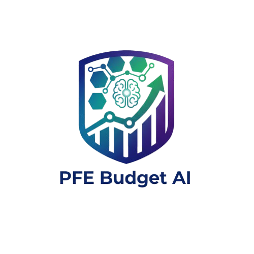

<p align="center">
  
</p>

<h1 align="center">PFE Performance Dashboard</h1>

<p align="center">
  <a href="https://www.odoo.com/">
    
  </a>
  <a href="https://www.gnu.org/licenses/lgpl-3.0.en.html">
    
  </a>
  <a href="https://www.python.org/">
    
  </a>
</p>

<br />

##  Présentation

Le module **PFE Performance Dashboard** est une solution complète développée pour Odoo 17 permettant le suivi dynamique et en temps réel des performances des projets PFE. Il offre aux chefs de projets et à la direction une visibilité à 360° sur l'avancement technique et financier.

##  Fonctionnalités Clés

- **Gestion de Projet Avancée** : Suivi des cycles de vie (Brouillon ➜ Planification ➜ Développement ➜ Test ➜ Livraison ➜ Terminé).
- **Contrôle Budgétaire** : Comparaison en temps réel entre le budget alloué et consommé avec calcul automatique du reste à dépenser.
- **Tableaux de Bord Interactifs** : Visualisation via des vues Kanban, Gantt et Graphiques pour une analyse rapide des KPIs.
- **Indicateurs de Performance (KPIs)** : Monitoring précis de l'avancement (%) et de la santé financière des projets.
- **Système d'Alertes Intelligent** : Notifications automatiques en cas de dépassement de budget ou de retard sur les échéances.

##  Intelligence Artificielle

Le module intègre une couche de Machine Learning pour transformer les données historiques en outils d'aide à la décision :

- **Prédiction des Alertes** : Algorithmes prédictifs analysant les tendances passées pour anticiper les risques de dérive budgétaire ou de retard de livraison.
- **Recommandations de Gestion** : Moteur de recommandation suggérant des actions correctives (réallocation de ressources, ajustement de planning) pour optimiser la réussite des projets.
- **Analyse de Santé des Projets** : Score de santé global calculé par ML basé sur la corrélation entre les multiples indicateurs du projet.

##  Spécifications Techniques

Ce module s'intègre nativement avec l'écosystème Odoo et utilise les modèles suivants :

- `pfe.project` : Cœur du système gérant les métadonnées et indicateurs du projet.
- `pfe.budget.line` : Détail des lignes budgétaires.
- `pfe.kpi` : Définition et calcul des indicateurs clés.
- `pfe.task` & `pfe.milestone` : Gestion granulaire de l'exécution.

### Dépendances

- `base`, `project`, `hr_timesheet`, `account`, `mail`

##  Procédure d'Installation

1. Copiez le dossier `pfe_performance` dans votre répertoire `addons`.
2. Redémarrez votre serveur Odoo.
3. Activez le **Mode Développeur**.
4. Allez dans **Applications** > **Mettre à jour la liste des applications**.
5. Recherchez "PFE Performance Dashboard" et cliquez sur **Installer**.

##  Structure du Projet

```text
pfe_performance/
├── data/               # Données de configuration et séquences
├── models/             # Logique métier (Projets, Budgets, KPIs)
├── security/           # Droits d'accès et règles de record
├── static/             # Assets CSS, JS et Images pour le Dashboard
├── views/              # Définition des interfaces (XML)
├── __init__.py
└── __manifest__.py     # Métadonnées du module
```

##  Contact Développeur

**Adama COULIBALY**  
📧 [startlingadama@gmail.com](mailto:startlingadama@gmail.com)  
*Ingénieur en Intelligence Artificielle*

---

<p align="center">© 2026. Tous droits réservés.</p>

